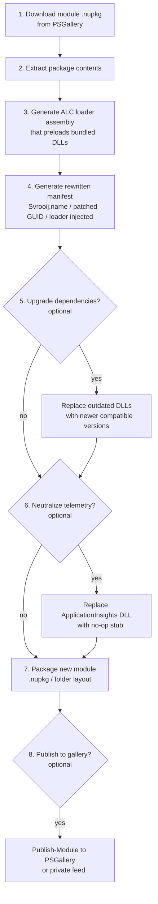

# PowerShellRepackager — Design Plan

## Problem statement

PowerShell modules that ship .NET assemblies (e.g. `MicrosoftTeams`, `Az.*`, `Microsoft.Graph.*`) are
notorious for "assembly version hell": multiple modules bundle different, sometimes incompatible,
versions of the same DLL (e.g. `Microsoft.Identity.Client`, `Newtonsoft.Json`,
`Microsoft.ApplicationInsights`). Because PowerShell loads everything into a single default
`AssemblyLoadContext` (the default `AssemblyLoadContext.Default` in PS 7 / .NET), the first module to
load a given assembly "wins", and every other module that expects a different version can fail with
`FileLoadException`, `MethodMissingException`, or silent incorrect behavior.

`PowerShellRepackager` is a tool that repackages an existing PowerShell Gallery module so that its
bundled assemblies are isolated in a private, named `AssemblyLoadContext` (ALC). This removes
cross-module DLL collisions without needing to fork/recompile the module's source.

The tool operates purely on the **published, packaged artifact** (the `.nupkg` from the PowerShell
Gallery) — no access to the original source code is required or assumed.

## High-level pipeline

## Step-by-step design

### Step 1 — Download the module package

- **Input:** module name (e.g. `MicrosoftTeams`), version (e.g. `7.9.0`), optionally a target
  PowerShell Gallery / NuGet v2 feed URL (default:
  `https://www.powershellgallery.com/api/v2/package/{name}/{version}`).
- **Mechanism:** the PowerShell Gallery serves modules as NuGet v2 packages. A plain authenticated-free
  HTTP GET against the above URL returns the raw `.nupkg` (which is a zip file, just with a different
  extension and a `.nuspec` + PS-specific metadata inside).
- **Output:** raw `.nupkg` bytes saved to a local cache directory, e.g.
  `./.cache/{name}/{version}/{name}.{version}.nupkg`.
- **Considerations:**
  - Validate the requested version exists (HTTP 404 handling, clear error).
  - Cache downloads by name+version so repeated runs don't re-download.
  - Optionally verify a checksum/signature if the Gallery exposes one (nice-to-have, not blocking).
  - Respect proxy / corporate network settings (use `HttpClient` with system proxy defaults).

### Step 2 — Extract the package

- A `.nupkg` is a standard zip archive. Extract to a working directory, e.g.
  `./.work/{name}/{version}/original/`.
- Identify and separate:
  - The module manifest (`{Name}.psd1`) — required, drives most of the rest of the pipeline.
  - The root module script/binary (`RootModule` entry in the manifest — could be a `.psm1`, `.dll`, or
    absent).
  - All bundled binary assemblies (`*.dll`), typically under a `bin` / runtime-specific subfolder
    (`bin/net472`, `bin/netstandard2.0`, `bin/net6.0`, `bin/core`, `bin/desktop`, etc. — layout is
    module-specific, not standardized, so this needs a discovery step: scan recursively for `*.dll`).
  - Any `.nuspec` file and PSGallery metadata (`_rels`, `package/services/metadata`, `[Content_Types].xml`)
    which are Gallery-internal packaging artifacts, not part of the "real" module content, and should be
    dropped from the repackaged output.
- **Output:** a normalized in-memory (or on-disk) model of:
  - Original manifest data (parsed `.psd1` as a hashtable/AST).
  - List of module files with relative paths, tagged by type (manifest, script, assembly, other data
    file e.g. `.ps1xml`, `.psm1`, resources, docs).
  - Detected target framework folder(s) for assemblies (needed later to decide which set of DLLs to
    preload for which PowerShell/.NET runtime — PS 7 uses net6.0/net8.0+, Windows PowerShell 5.1 uses
    net48/desktop assemblies and is out of scope for ALC isolation since WinPS uses classic AppDomain
    behavior, not ALCs).

### Step 3 — Generate the Assembly Load Context loader

Goal: ensure that when the module is imported, all of its bundled DLLs are loaded from a dedicated,
named `AssemblyLoadContext` instead of `AssemblyLoadContext.Default`, so that identically-named
assemblies with different versions used by other modules never collide.

- **Design:** generate a small C# "loader" project per repackaged module that:
  1. Defines a custom `AssemblyLoadContext` subclass, e.g. `Svrooij{Name}LoadContext`, constructed with
     `isCollectible: false` and a base directory pointing at the module's own `bin` folder at runtime
     (resolved relative to the assembly's own location, not a hardcoded path).
  2. Overrides `Load(AssemblyName)` to:
     - First check if the requested assembly is one of the bundled DLLs (by simple name) — if so,
       resolve and load it from the module's private folder via an `AssemblyDependencyResolver` (the
       standard .NET-provided resolver that reads the deps.json / probes the folder) or a folder-scan
       fallback.
     - Otherwise return `null` so the request falls through to `Default` (important: framework/shared
       assemblies like `System.*`, and the `System.Management.Automation` / PowerShell SDK assemblies
       themselves, MUST resolve to the Default ALC's already-loaded instances, otherwise PowerShell
       interop breaks — types crossing ALC boundaries must be identical types).
  3. Exposes a static entry point, e.g. `Svrooij{Name}Loader.Initialize()`, that:
     - Creates the ALC singleton (idempotent — guard against double-init if the module is
       imported/removed/re-imported).
     - Pre-loads (eagerly resolves) each bundled DLL into that ALC so that when PowerShell's normal
       module-loading mechanism later loads the module's actual cmdlet assembly, any static
       constructors / reflection that expects those dependencies to already be resolvable succeed
       through the ALC's `Resolving` event / custom `Load` override, not through `Default`.
     - Hooks `AssemblyLoadContext.Default.Resolving` (or relies purely on the module's own assembly
       being loaded into the custom ALC) — exact mechanism to decide during implementation; two known
       patterns exist:
       - **Pattern A (preferred):** Load the module's *root* cmdlet assembly itself into the custom
         ALC (not Default). Then all of its transitive dependency loads naturally happen through that
         ALC's `Load` override. This requires the manifest's `RootModule`/`NestedModules`/
         `RequiredAssemblies` to actually point at the loader instead of directly at the original DLL
         (see Step 4).
       - **Pattern B (fallback, if PowerShell's module loader won't let us intercept which ALC the root
         assembly loads into):** keep the root cmdlet assembly loading normally into Default, but use
         `Default.Resolving` to redirect *specific known-conflicting* dependency names to instances
         loaded in the private ALC. More fragile, only used if Pattern A proves infeasible for a given
         module (some modules use `[Cmdlet]` types with binary serialization / type identity
         requirements that break across ALCs).
  4. Is careful about **type identity**: any exported type that PowerShell itself binds to (e.g.
     `Cmdlet`, `PSCmdlet`, custom `PSTypeConverter`, custom formatting types referenced from `.ps1xml`)
     must remain resolvable/compatible; only *internal* dependencies (JSON parsers, HTTP clients, auth
     libraries, telemetry SDKs, etc.) should be isolated. The loader design needs a small "shared /
     never isolate" allow-list (PowerShell SDK assemblies, `netstandard`, `System.*`, `mscorlib`) that
     is always resolved through Default.
- **Output:** loader source is *generated* (templated) per module, compiled into a small
  `Svrooij.{Name}.Loader.dll`, and this loader DLL is the one placed into the module's `RootModule`
  entry point.
- **Build:** the generator needs to actually compile this generated C# — either:
  - Ship a small prebuilt generic "loader" library once, parameterized at runtime via a config file /
    embedded resource listing the module's bin folder and the list of DLL names to isolate (**preferred
    — avoids per-module compilation, faster, no build toolchain dependency at repackage time**), or
  - Emit and compile a per-module C# project with `dotnet build` (more flexible but requires the .NET
    SDK to be present wherever repackaging runs).
  - **Recommendation:** build a single reusable, generic `Svrooij.PSAssemblyIsolation` runtime library
    (ships once, versioned independently) that takes a manifest/config (JSON or embedded resource
    listing bundled DLL names + relative bin path) and does the ALC + preloading work generically. Then
    "generating the loader" in Step 3 becomes "generate a small config artifact + copy the prebuilt
    generic loader DLL into the package", not "generate and compile new C# per module". This avoids
    needing a full C# compiler at repackage time and is much more robust.

### Step 4 — Generate the rewritten manifest

- Parse the original `.psd1` (use PowerShell's own AST parser, not regex, to avoid corrupting complex
  manifests) and produce a new manifest with:
  - **Name change:** module folder + manifest file renamed from `{Name}` to `Svrooij.{Name}`.
  - **GUID change:** parse the existing `GUID` field, replace the first 4 hex characters with `2807`,
    keep the remaining structure valid (still a well-formed GUID). This creates a deterministic,
    recognizable "family" of repackaged modules while avoiding GUID collision with the original.
  - **RootModule / NestedModules rewrite:** point at the generic loader DLL (Step 3) instead of the
    original binary module entry, so importing `Svrooij.{Name}` triggers ALC initialization before (or
    as part of) loading the real cmdlet assembly. Exact mechanism depends on Pattern A/B decision above
    — likely a small `.psm1` `RootModule` that calls `Initialize()` then dot-sources / imports the real
    binary module, OR a `ModuleToProcess`/`RequiredAssemblies` ordering trick.
  - **FileList/RequiredAssemblies/FormatsToProcess/TypesToProcess paths:** rewritten to match new
    relative locations if the folder layout changes at all (should try to preserve original relative
    layout to minimize risk).
  - **Preserve everything else:** version, author, description, `PowerShellVersion`,
    `CompatiblePSEditions`, exported cmdlets/functions/aliases, `RequiredModules`, `Copyright`, etc.,
    should be carried over unchanged (with maybe an appended note in `Description` / a custom
    `PrivateData` entry marking this as a repackaged build, including the original version + repackage
    tool version for traceability).
  - **ModuleVersion:** keep identical to original by default (same version number), so users depending
    on `RequiredModules @{ModuleName='Svrooij.MicrosoftTeams'; RequiredVersion='7.9.0'}` get predictable
    behavior. (If Step 5 upgrades dependencies, consider whether that should bump a 4th version
    component / prerelease tag to distinguish rebuilds — decide during implementation.)
- **Output:** new `Svrooij.{Name}.psd1` written into the new package layout.

### Step 5 — (Optional) Upgrade dependencies

- If requested via a flag/config (e.g. `-UpgradeDependencies` or a mapping file
  `{ "Microsoft.Identity.Client": "4.61.3" }`), replace specific bundled DLLs with newer versions
  pulled from NuGet.org before packaging.
- **Mechanism:**
  - Resolve the target package + version from NuGet.org (`nuget.org/v3` API), download its `.nupkg`,
    extract the matching-TFM assembly, and substitute it in place of the original bundled DLL (or add
    it alongside if the module's loader can be pointed at multiple versions — usually a straight
    replace).
  - Must check **binding compatibility** heuristically: same public API surface / no known breaking
    major version jump unless explicitly forced. This is inherently risky — flag prominently in output
    logs and require an explicit opt-in per dependency, not a blanket "upgrade everything".
  - Because dependencies are isolated in their own ALC (Step 3), upgrading them is *safer* than in a
    normal shared-context scenario, since the private ALC can carry a different Newtonsoft.Json/etc.
    version without needing to match whatever version some other loaded module expects.
- **Output:** updated bin folder with newer DLLs, updated loader config (Step 3) reflecting any renamed
  files.

### Step 6 — (Optional) Neutralize telemetry (ApplicationInsights)

- Many Microsoft-authored modules bundle `Microsoft.ApplicationInsights.dll` and related SDKs that
  phone home telemetry (cmdlet usage, timings, sometimes more).
- If requested, replace the real `Microsoft.ApplicationInsights.dll` (and related, e.g.
  `Microsoft.ApplicationInsights.PerfCounterCollector.dll` if present) with a **binary-compatible
  no-op stub**: same public type surface (same assembly name, same public classes/methods signatures
  used by the host module), but every method is a no-op / returns default/empty results, and nothing is
  ever sent over the network.
- **Approach for building the stub:**
  - Reflect over the original DLL's public API surface actually *used* by the host module's assemblies
    (via `ildasm`/`Mono.Cecil`/`System.Reflection.MetadataLoadContext` static analysis) to know the
    minimum surface that must exist.
  - Author/generate a minimal C# replacement project implementing just that surface, compiled once
    (per major AI SDK API version, likely reusable across many modules since ApplicationInsights API is
    fairly stable) into a prebuilt stub DLL shipped with the repackager tool (similar reuse strategy as
    Step 3's generic loader) — **not** regenerated per module.
  - Assembly identity (name, and ideally strong-name/public key token if the original is strong-named
    and something checks that) needs to match closely enough for reference binding to succeed; note:
    since the DLL lives in a private ALC, exact strong-name matching requirements are more lenient than
    if it were shared, but should still be verified for the specific module's usage pattern (e.g. does
    it call `TelemetryClient.TrackEvent` reflectively or as a direct reference).
  - **Fallback if full stubbing proves fragile:** consider disabling telemetry via existing 
    configuration-based opt-outs the SDK already supports (many Microsoft modules honor an
    environment variable, e.g. `APPLICATIONINSIGHTS_NO_DIAGNOSTIC_TELEMETRY` or a module-specific
    `$env:...OptOut` variable) as a simpler, lower-risk alternative to binary replacement, if such a
    switch exists for the given module. Document per-module findings.
- **Output:** replaced (or config-disabled) telemetry assembly in the new package's bin folder.

### Step 7 — Package the new module

- Assemble the final on-disk module folder layout: `Svrooij.{Name}/{Version}/...` (PowerShell "versioned
  module folder" convention) containing:
  - `Svrooij.{Name}.psd1` (Step 4 output)
  - Generic loader DLL + generated per-module config (Step 3 output)
  - All original module content (scripts, formats, types, help, licenses, `bin/*.dll` — patched per
    Steps 5/6 where applicable)
- Produce two possible output artifacts:
  1. A plain folder (drop-in installable via `Copy-Item` into a `$env:PSModulePath` location, or via
     `Install-Module -Repository <local>` against a local NuGet feed).
  2. A `.nupkg` built with the same NuGet v2 package structure the Gallery expects (`.nuspec` +
     `package/services/metadata/...` + content), so it can be pushed to a NuGet-compatible feed
     (PowerShell Gallery, Azure Artifacts, a local `nuget.exe`/`dotnet nuget` feed) using standard
     PowerShellGet / `Publish-Module` tooling.
- Include a manifest note / `PrivateData.PSData` entries documenting: original module name+version,
  repackage tool version, timestamp, list of any dependency upgrades or telemetry changes applied — for
  auditability.

### Step 8 — (Optional) Publish

- If requested (`-Publish` flag + API key), run the equivalent of `Publish-Module -Path ... -NuGetApiKey
  ... -Repository PSGallery` (or a custom `-Repository` name for a private feed).
- Must not be a silent default — always opt-in, since publishing is irreversible-ish (versions can't be
  reused on the Gallery) and requires credentials.
- Validate manifest via `Test-ModuleManifest` before attempting publish; surface all validation errors.
- Support dry-run mode (`-WhatIf`) that does everything except the actual publish network call.

## Cross-cutting concerns

- **CLI / entry point design:** likely a PowerShell module itself (dogfooding) or a small .NET CLI, exposing
  one command per step plus a single "do everything" orchestrator command, e.g.:
  - `Invoke-ModuleRepackage -Name MicrosoftTeams -Version 7.9.0 [-UpgradeDependency @{...}]
    [-DisableTelemetry] [-Publish] [-ApiKey ...] [-OutputPath ...]`
  - Individual sub-commands (`Get-ModulePackage`, `Expand-ModulePackage`, `New-AssemblyLoader`,
    `New-RepackagedManifest`, `Update-BundledAssembly`, `Disable-ModuleTelemetry`,
    `Compress-ModulePackage`, `Publish-RepackagedModule`) so the pipeline is scriptable/testable in
    isolation and steps 5/6/8 stay clearly optional.
- **Idempotency & caching:** re-running for the same name+version should reuse cached downloads/extracts
  unless `-Force` is given.
- **Multi-TFM support:** must correctly handle modules that ship multiple runtime-specific DLL sets
  (Desktop/net472 vs. Core/net6+); ALC isolation is only meaningful/applicable for the .NET (Core)
  runtime folder — Windows PowerShell 5.1 (net472) compatibility should be explicitly out of scope or
  handled by simply not touching those assemblies.
- **Safety / correctness validation:** after repackaging, run an automated smoke test — import the new
  module in a clean `pwsh -NoProfile` process, list exported commands, and (if feasible) invoke at least
  one non-networked cmdlet (e.g. `Get-Help`, a `-WhatIf` no-op) to catch obvious loader breakage before
  declaring success.
- **Logging & traceability:** every generated artifact should embed original module name/version, tool
  version, and a summary of applied optional steps, both in the manifest `PrivateData` and in a
  human-readable `REPACKAGE-NOTES.md`/log file alongside the output.
- **Legal/licensing:** repackaging and redistributing a third-party module (especially Microsoft-owned
  ones like `MicrosoftTeams`) under a different name/publisher may have licensing implications —
  preserve original license/copyright files unmodified in the output and clearly attribute the original
  source/authorship in the new manifest's `Description`/`CopyrightNotice`; do not claim original
  authorship. This should be flagged to the user before any `-Publish` step runs.

## Open questions / decisions needed before implementation

1. Pattern A vs. Pattern B for how the root module gets loaded into the custom ALC (needs a small
   spike/prototype against a real module like `MicrosoftTeams` to confirm PowerShell's binary module
   loader behavior with ALCs).
2. Generic prebuilt loader library vs. per-module compiled loader (recommendation: generic, see Step 3).
3. Scope of "upgrade dependencies" safety checks — how much binary-compatibility verification is
   feasible vs. just trusting semantic versioning + user opt-in.
4. Whether ApplicationInsights stubbing is worth the maintenance cost vs. relying on existing telemetry
   opt-out switches where available (Step 6 fallback).
5. Target implementation language/host: a PowerShell module (7+) calling into a small companion .NET
   library for ALC/manifest/assembly manipulation, vs. a standalone .NET CLI tool. (Given the domain —
   PowerShell module packaging — a PowerShell module front-end with a compiled helper assembly seems
   most natural and dogfoods the same isolation technique.)

## Suggested implementation order

1. Prototype Step 3/4 manually against one real module (`MicrosoftTeams`) to validate the ALC loading
   pattern actually resolves the DLL-collision problem end-to-end, before automating anything.
2. Build Steps 1–2 (download + extract) — straightforward, low-risk, needed by everything else.
3. Build Step 4 (manifest rewrite) using the validated pattern from the prototype.
4. Build the generic loader library + Step 3 automation (config generation only, reusing the prebuilt
   library).
5. Build Step 7 (packaging) so an end-to-end "download → repackage → install locally → smoke test"
   loop exists.
6. Add Step 8 (publish) behind an explicit opt-in flag.
7. Add optional Steps 5 (dependency upgrade) and 6 (telemetry stub) last, since both are higher-risk /
   higher-effort and not required for the core value proposition (DLL isolation).
